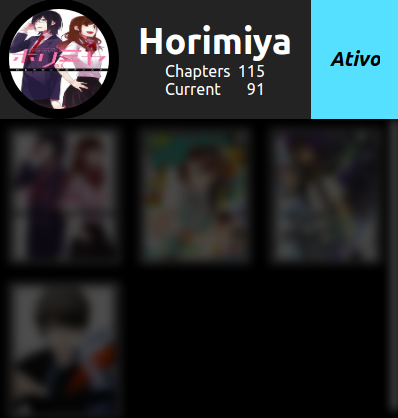
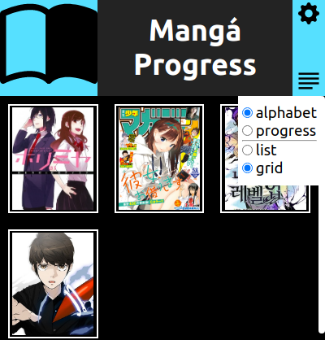
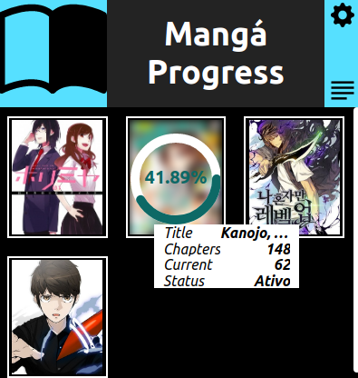
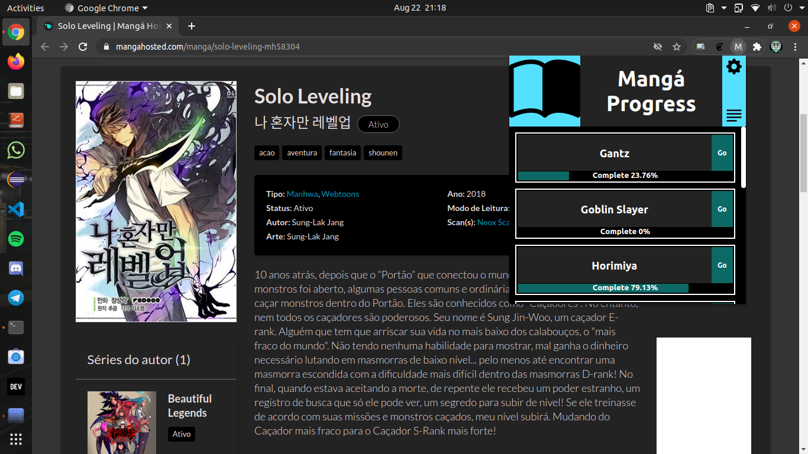

# *Manga Progress*

## :dart: Objetivo
Gerenciar leitura de mangás.

## :bulb: Justificativa
O site onde normalmente leio mangás, tem a necessidade de se logar com o Facebook para realizar o gerenciamento dos mangás lidos pelos usuários, mas não tenho cadastro na rede social, então decidir criar essa extensão Web. Além que gostaria de testa o [Vue.js](https://vuejs.org/).

## 	&#x1F4F8; Screenshot
<p align="center" display="flex">
    
  
  
  
  
  
  
  
</p>

## :gear: Instalação

### :file_folder: Repositório
```sh
git clone https://github.com/dannRocha/manga-progress.git
```
###  Google Chrome
* Inicie o Chrome;
* Na barra de pesquisa digite ***chrome://extensions/*** ;
* Na canto superior direito ative o modo de desenvolvedor;
* Arraste a pasta do repositório para a janela das extensões;

## &#x1F5A5;&#xFE0F; Como usar

Nos sites que possuem suporte a extensão, acesse a página de cada mangá que deseja acompanhar e clique na estrela (:star:) para que seja adicionado aos seus favoritos.

<p align="center">
	
</p>

## &#x1F477;&#x1F3FE;&#x200D;&#x2642;&#xFE0F; Suporte

<ul>
	<i><strong><a href="https://mangahosted.com/"><li>Mangá Host</li></a></strong></i>
	<i><strong><strike><a href="http://centraldemangas.online/"><li>Central de Mangás</li></a></strike></strong></i>
	<i><strong><strike><a href="https://unionmanga.xyz/"><li>Union Mangá</li></a></strike></strong></i>
</ul>
